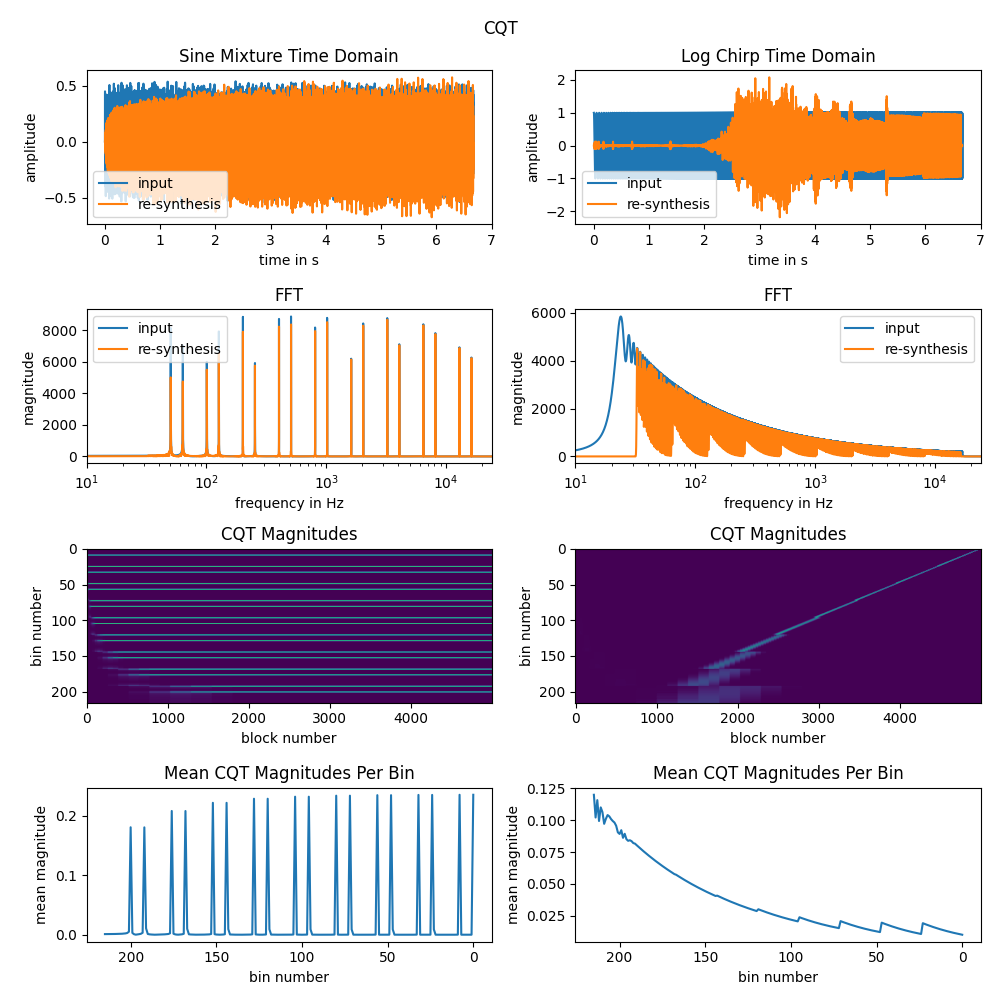
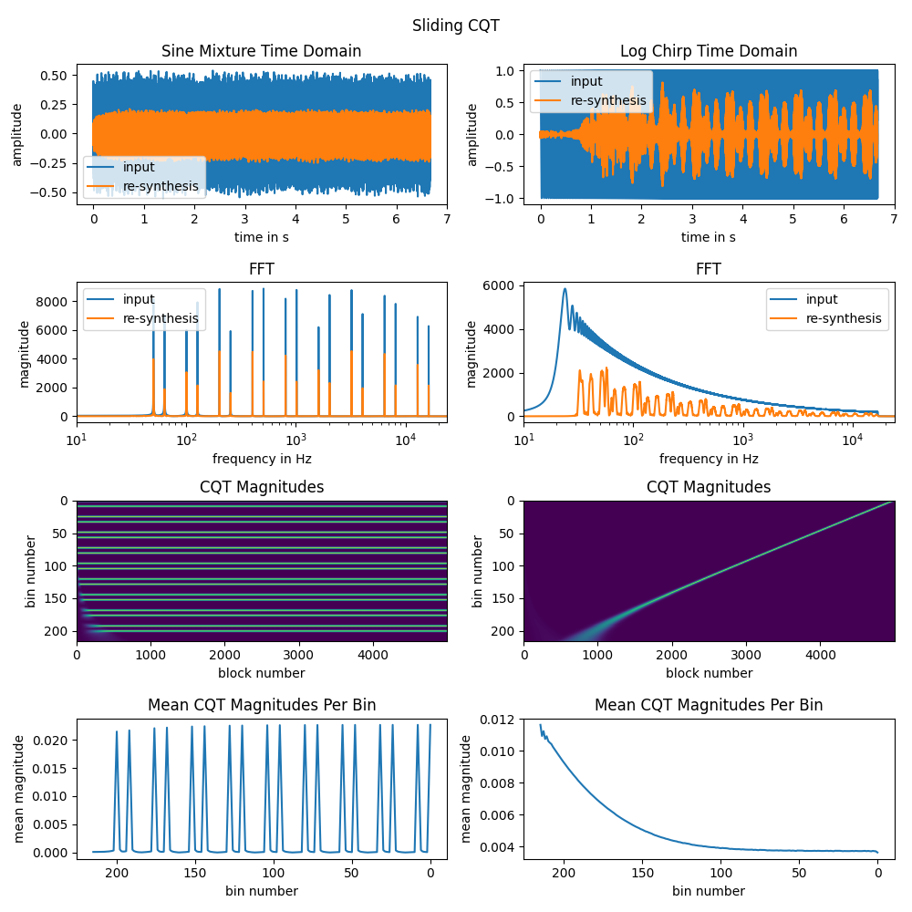

# rt-cqt: Real-Time Constant-Q Transform
rt-cqt aims to be a reasonable fast, header-only C++11 library for performing the Constant-Q Transform (CQT), optimized for real-time audio applications. It supports dynamic handling of different block sizes and sample rates, making it ideal for scenarios with varying audio processing demands. The library offers two distinct implementations:

1. Constant-Q Transform ([include/ConstantQTransform.h](include/ConstantQTransform.h)): This version performs a Fast Fourier Transform (FFT) for each octave.
2. Sliding Constant-Q Transform ([include/SlidingCqt.h](include/SlidingCqt.h)): This version minimizes latency by continuously updating frequency bins with every new audio sample, making it particularly suitable low-latency applications.

Both implementations utilize polyphase IIR lowpass filters for efficient upsampling and downsampling, which reduces computational overhead by processing lower octaves at reduced sample rates. 

## Constant-Q Transform
The implementation is roughly based on the [Judith C. Brown, Miller S. Puckette: An efficient algorithm  for the calculation  of a constant Q transform](http://academics.wellesley.edu/Physics/brown/pubs/effalgV92P2698-P2701.pdf) paper.
[pffft](https://github.com/marton78/pffft) is used to handle the ffts.

An example can be found in [examples/cqt.cpp](examples/cqt.cpp).

Even though this library is header-only, the pffft implementation is not. Hence, the following files have to be linked into your project:
```cpp
submodules/pffft/pffft.c
submodules/pffft/pffft_common.c
submodules/pffft/pffft_double.c
```

## Sliding Constant-Q Transform
While the regular Constant-Q Transform performs an FFT for each octave and hop, the CQT can also be implemented in a sliding manner, where the hop size is effectively reduced to 1 sample.
The implementation follows [Russell Bradford, John ffitch, Richard Dobson: SLIDING WITH A CONSTANT Q](https://purehost.bath.ac.uk/ws/portalfiles/portal/377255/constQ.pdf). Since this method does not rely on FFTs, the implementation remains lightweight, header-only, and free from external dependencies like pffft.

An example can be found in [examples/scqt.cpp](examples/scqt.cpp).

## Python Bindings
This is WIP. Python bindings can be found in the `python-bindings` folder, using [pybind11](https://github.com/pybind/pybind11).

## Example Projects
[CQT Analyzer Audio-Plugin based on iPlug2](https://github.com/jmerkt/cqt-analyzer)

[WIP Reverb plugin operating in Sliding CQT domain](https://github.com/jmerkt/harmonic-reverb)

## Limitations and Future Work
* While the Polyphase IIR lowpasses are cheap, they distort the phase of the signal. For future, a linear phase approach could be added.
* Amplitudes in CQT domain, as well as for the re-synthesized signal for Sliding CQT are quite low, especially when using the windowed version. WIP to find out why and how to fix it.

## Current Status Illustration

For illustration of the current status, python binds are used to create some plots ([python-bindings/examples/illustration.py](python-bindings/examples/illustration.py)). 

* 24 bins per octave, 9 octaves and a block size of 64 samples.
* Two different input signals. A mixture of sine tones (note c and e with equal amplitude across all octaves) and a logarithmic sine chirp.
* Lower latency of the sliding transform becomes quite visible for the chirp input signal. CQT with big hop sizes can't properly resolve the low frequencies of the chirp.
* Amplitudes of the sliding transform are quite low.
* Re-synthesis for both approaches is not perfect. Especially for the chirp signal, phase is distorted quite heavily. FIR lowpass filters for downsampling might help here.






